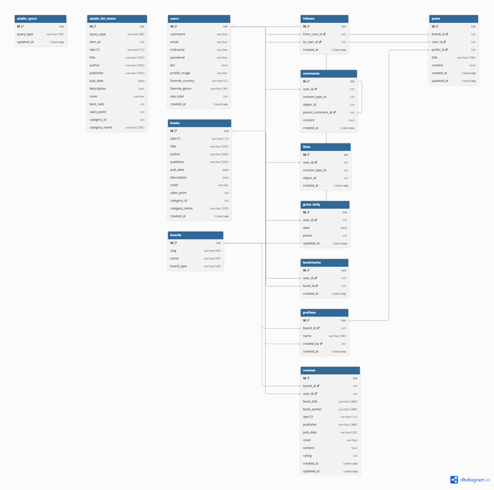
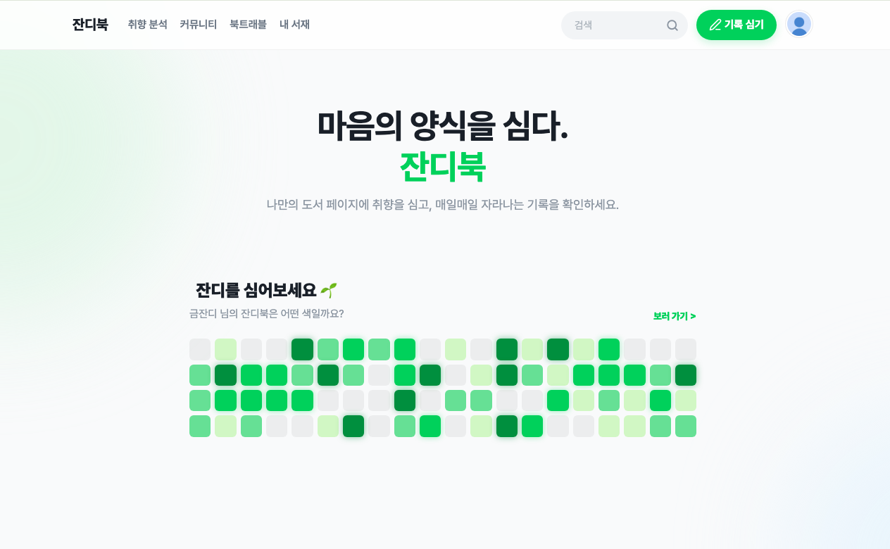
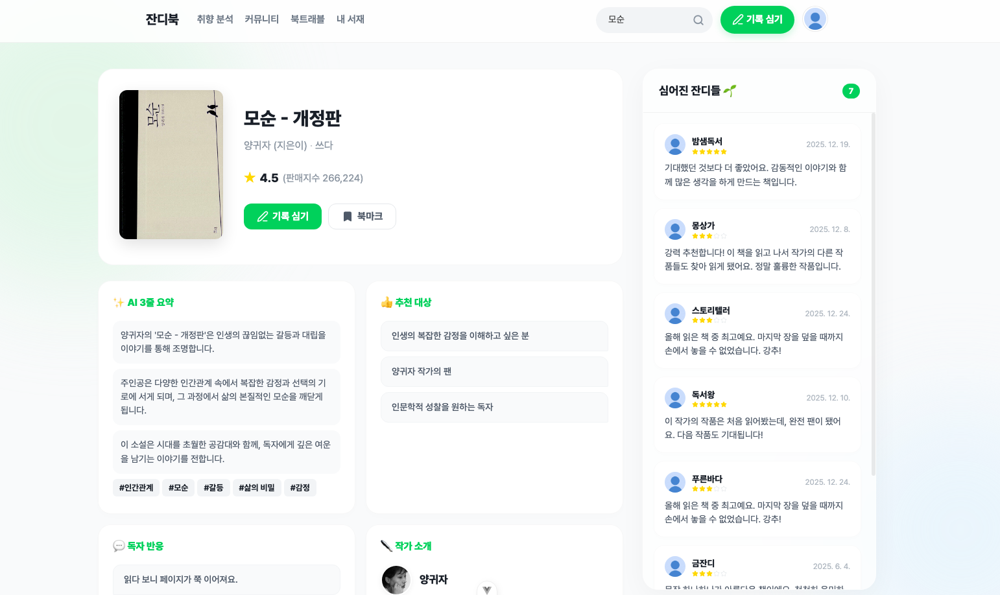
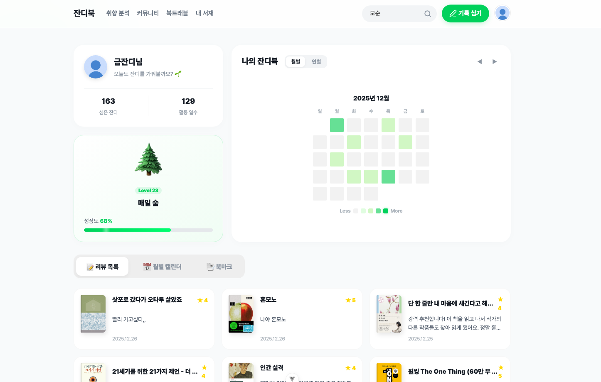
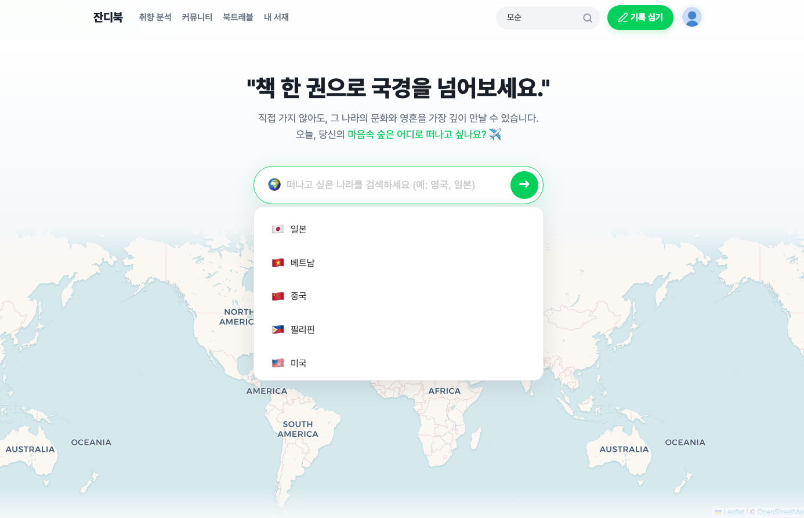
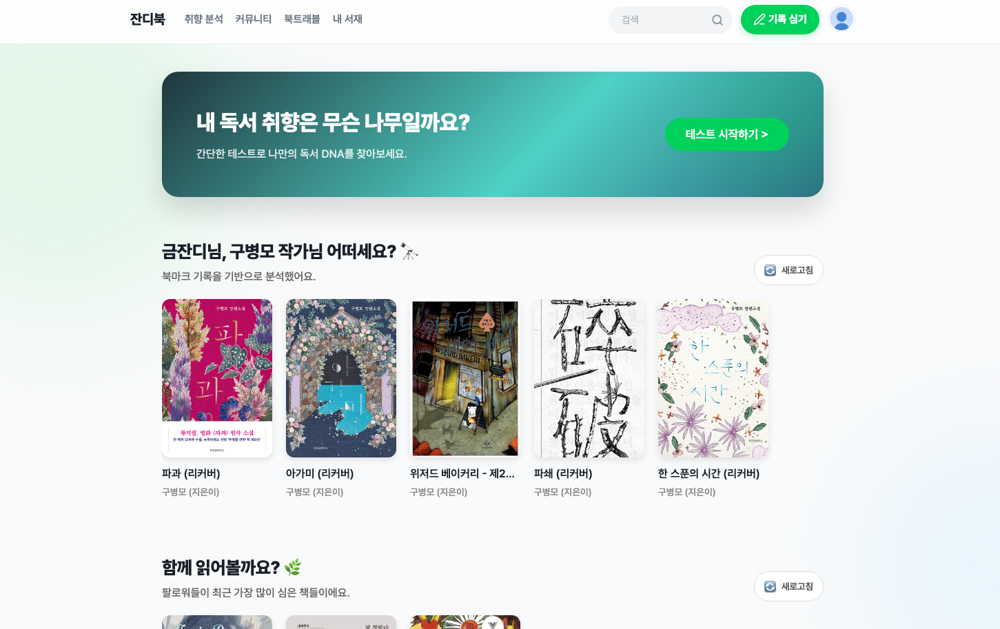
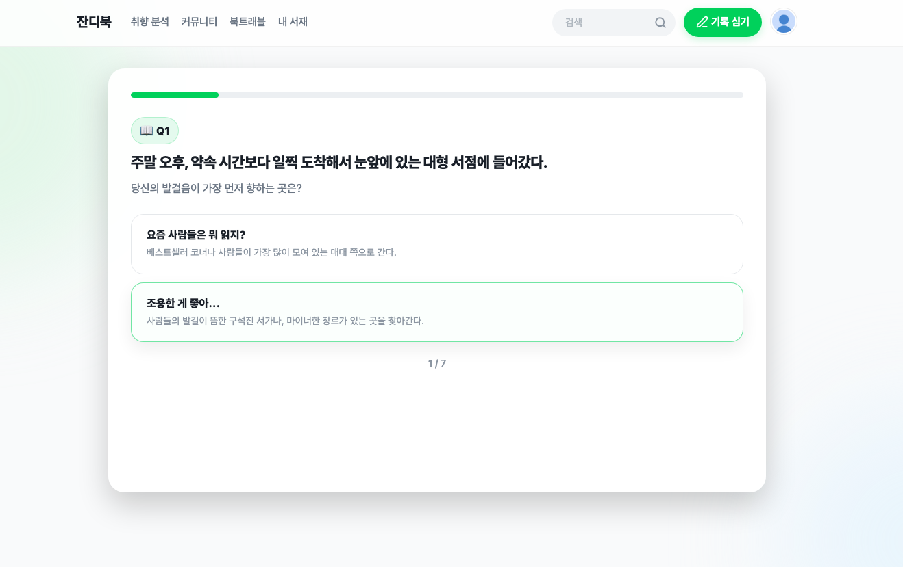
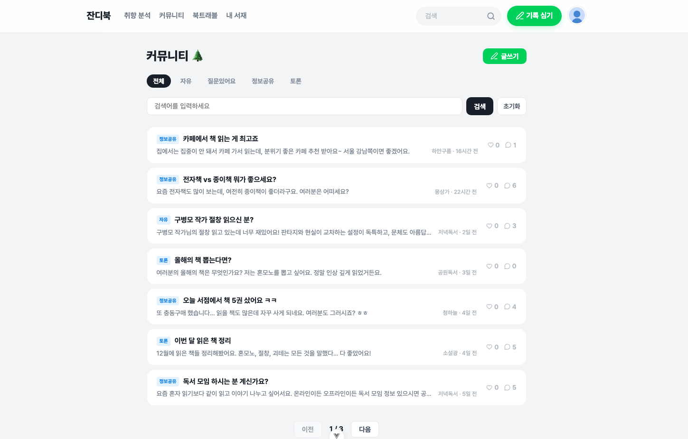

# 📚 잔디북(JandiBook) 🌱  

## 📌 프로젝트 개요
- 프로젝트명 : 잔디북 (JandiBook)

- 설명 : 사용자의 독서 활동을 “잔디(Grass)”로 시각화해 동기부여를 높이고, 국가별 도서 탐색·커뮤니티·AI 큐레이션을 통해 지속 가능한 독서 습관을 돕는 서비스

- 기간 : 2025년 12월 19일 ~ 12월 26일 (SSAFY 1학기 관통 프로젝트)

- 배포 여부 : 미배포 (로컬 개발 환경 기준)

---

## 🎯 문제 정의 & 타겟 사용자

### 😵 문제 상황
- 책을 고르는 과정이 어렵고, 추천을 받아도 “왜 추천인지” 납득이 어려움
- 독서 기록이 끊기기 쉬워 습관 형성 동기부여가 약함
- 같은 관심사를 가진 사람들과 후기/정보/토론을 나눌 공간이 부족함
- 나라별 도서 검색을 할 수 있는 곳이 없음

### 👤 타겟 사용자
- “무슨 책 읽지?”에서 막히는 입문 독서 사용자
- 기록/습관을 만들고 싶은 독서 루틴 구축 사용자
- 취향이 비슷한 사람과 리뷰·질문·토론을 나누고 싶은 사용자
- 국가별 베스트셀러·신간 등 테마 기반 탐색을 선호하는 사용자

---

## ⭐ 서비스 특징
- 🌱 잔디(Grass) 시스템으로 독서 활동을 시각화 → 동기부여 & 습관 개선
- 🌍 국가별 도서 탐색(베스트셀러/추천 리스트 캐시)으로 테마 독서 경험 제공
- 💬 커뮤니티(자유/리뷰)에서 질문·정보공유·토론을 통해 독서 인사이트 확장
- 🤖 AI 큐레이터로 취향/도서 정보를 바탕으로 추천 및 사유 제공
- ⚡ 알라딘 API 호출을 DB 캐싱(TTL)하여 빠르고 안정적인 조회 제공

---

## ⚙️ 주요 기능
- 회원가입 / 로그인 (JWT)
- 알라딘 기반 도서 조회
  - 베스트셀러/신간 등 리스트 조회(캐시)
  - 도서 상세 조회(필요 시 DB 저장)
  - 도서 검색
- 북마크(나만의 서재)
- 커뮤니티
  - 자유게시판/리뷰 게시판 CRUD (말머리 기능 포함)
  - 댓글/대댓글 CRUD
  - 좋아요 토글 (대상별 liked 상태 포함)
  - 리뷰 평점 시스템 (1-5점)
- 팔로우/팔로잉 및 사용자 프로필 조회
- 마이페이지
  - 내 정보 조회, 활동 내역(글/댓글/북마크/팔로우 등)
  - 잔디 히트맵(활동 시각화), 레벨/경험치
- AI 기능
  - 취향 기반 추천(프롬프트 + 후보군 구성)
  - 도서 AI 분석(요약/키워드/추천 타겟 등) 캐시 저장

---

## 🦾 팀 소개
| 구분 | 담당 |
| --- | --- |
| 팀장 이승연 | Backend · AI · 디자인 |
| 팀원 이세영 | Frontend · 기획 |

---

## 🏗️ 기술 스택

| 영역 | 기술 |
| --- | --- |
| Frontend | Vue.js / pinia |
| Backend | Django / Django REST Framework / SQLite |
| AI | OpenAI GPT (gpt-4o) |
| DB | SQLite |
| 외부 API | 알라딘 도서 API / 위키피디아 API |
| 인증 | JWT |

---

## 🔍 기능 상세 설명

### 🌱 잔디(Grass) 시스템
- 리뷰 등 활동을 점수로 환산해 일별 잔디 데이터로 저장
- GitHub 스타일 히트맵으로 시각화하여 지속 동기부여 제공
- 경험치 기반으로 레벨/진행률 제공

### 🌍 국가별 도서 추천(리스트 캐시)
- 알라딘 ItemList 기반 리스트(예: Bestseller, ItemNewSpecial 등)를 DB에 캐싱
- TTL(예: 24h) 기준으로 신선도 체크 후 만료 시에만 갱신 → 외부 API 의존/지연 최소화
- 프론트는 홈/탐색에서 테마형 섹션으로 노출

### 💬 커뮤니티(자유/리뷰)
- 게시글/리뷰 CRUD + 댓글 CRUD + 좋아요 토글
- 작성자만 수정·삭제 가능하도록 권한 제어
- 좋아요 상태(liked)까지 내려줘서 새로고침 없이 UI 즉시 반영 가능

### 📌 북마크(나만의 서재)
- 도서 상세에서 북마크 토글
- 마이페이지에서 북마크 목록 조회

### 👤 사용자/팔로우
- 사용자 프로필 조회
- 팔로우 토글 후 서버값 재조회(fetchMe 등)로 안전한 동기화 방식 적용

---

## 🧠 추천 시스템(기술 설명 요약)

### 1) 기본 추천(리스트 기반)
- 알라딘 ItemList(예: 주목할 만한 신간)를 기본 추천으로 제공
- 개인화 추천이 성립하지 않거나 데이터가 부족한 경우에도 항상 기본 섹션으로 UX 유지

### 2) 개인화 추천(조건부 노출)
- 북마크/팔로우 기반으로 후보군 구성
- 섹션별로 “권수 조건(예: 5권 충족 시만 노출)”을 둠

### 3) AI 큐레이터(프롬프트 + 검증)
- 사용자 입력/성향 → 추천 프롬프트 구성
- 후보군은 DB(알라딘 캐시/도서 상세) 기반으로 구성해 근거 있는 추천을 지향
- 도서 AI 분석(요약/키워드/추천 타겟 등)은 DB에 캐시해 재사용

---

## 🤖 생성형 AI를 활용한 부분
- AI 큐레이터 기능 구현: 추천/분석 결과를 JSON 형태로 받는 프롬프트 설계 및 응답 파싱
- 도서 취향 분석 테스트 구현: 사용자의 선택형 설문 응답을 바탕으로 독서 성향(선호 장르/분위기/전개 속도 등) 키워드를 추출하고, 
이를 프롬프트에 반영해 추천 도서와 추천 사유를 생성하도록 설계(응답은 JSON 형식으로 받아 파싱 및 검증 로직 적용)
- 디버깅 보조: 오류 원인 추적, 예외 케이스 점검
- UI/UX 개선: 컴포넌트 구조 정리, 마이크로 카피(버튼/안내 문구) 다듬기

---

## 🗄️ ERD

---

## 🖼️ 실행 화면

     

 

---

## 🌐 서비스 URL
### 로컬 개발 환경
- Backend: `http://127.0.0.1:8000`
- Frontend: `http://localhost:5173`

---

## 📚 학습 내용
- Django REST Framework ↔ Vue 데이터 흐름 설계 및 연동 경험
- 외부 API(알라딘) 호출을 DB 캐싱/갱신(TTL)로 안정화하는 방식 학습
- JWT 인증/인가, 인터셉터 패턴, 401 처리 등 인증 UX 설계
- 협업 시 브랜치 전략과 충돌 해결, 기록 기반 의사결정의 중요성 체감

---

## 💡 느낀 점

### 팀장 이승연 (Backend · AI · 디자인)
짧은 기간 안에 API 캐싱, 인증, 커뮤니티, AI 기능까지 함께 구현하며    
기능 구현뿐 아니라 구조(데이터 흐름/캐시/예외 처리)가 서비스 품질을 좌우한다는 점을 체감했습니다.  
협업을 위해 노션을 통해 프로젝트 상황을 관리하려고 했는데 쉽지 않다고 느꼈고  
디자인, 프론트, 백엔드의 긴밀한 연결이 있어야 작업 속도도 빠르고 사이트도 깔끔하게 작동되는 거라고 생각했습니다.   
때문에 초기 단계 기획부터 많은 소통과 의견 교류, 문서화를 통해 팀 전체의 방향성을 맞추는 것이 중요하다고 느꼈습니다.    
여러 시행착오를 겪으면서 프로젝트를 완성하여 뿌듯함도 있고, 아직 부족한 점이 많다는 것을 알게 되었던 프로젝트였습니다.

### 팀원 이세영 (Frontend · 기획)
기능 단위로 역할을 나누되, 의사결정과 논의 과정을 문서로 남기면서  
팀 전체의 방향성을 맞추는 과정이 협업 효율에 큰 영향을 준다는 것을 배웠습니다.  
결국 기억보다 기록이 더 중요하다는 교훈을 얻었습니다.  
백엔드, 프론트, 디자인이 어떤 순서로 어떻게 연결되어야 하는지 알 수 있는 기회가 되었습니다.  
또한, 이번 기회로 다음 프로젝트에서 어떻게 하는 것이 좋은지 알 수 있었습니다.  

---

## 🚀 향후 개선 방향
- 추천 고도화 : 사용자 행동 기반 실시간 개인화, 도서 유사도 모델 개선
- 나라별 도서 추천 시스템 개선 : 나라별 다양한 저자와 도서 추천하도록 개선
- 커뮤니티 확장 : 비밀글 기능, 알림, 신고/블라인드, 뱃지/챌린지 등 참여 유도 장치 강화
- 성능 최적화 및 배포

---

잔디북(JandiBook) 🌱📚
